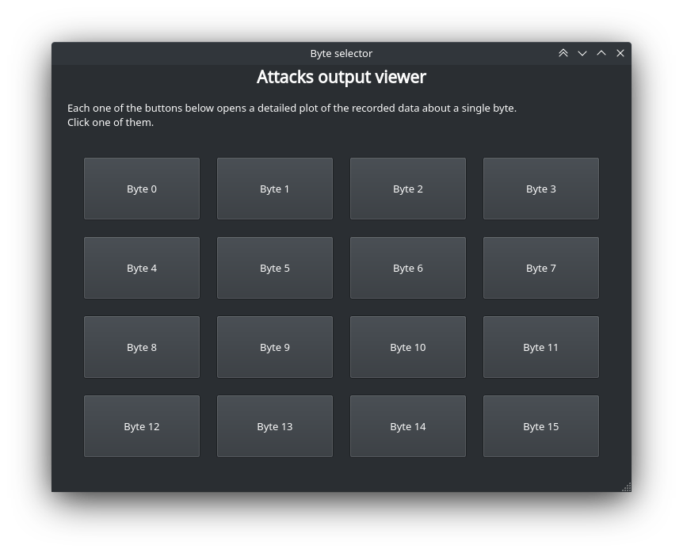
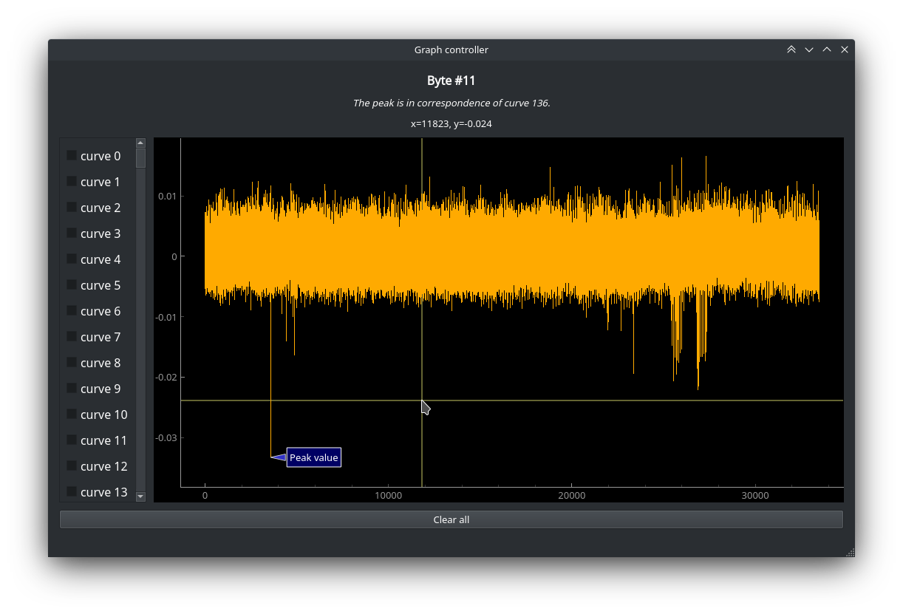
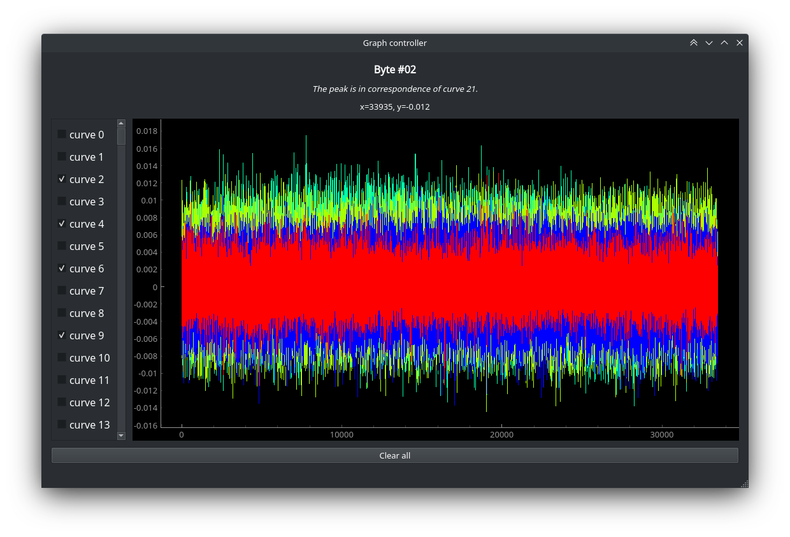
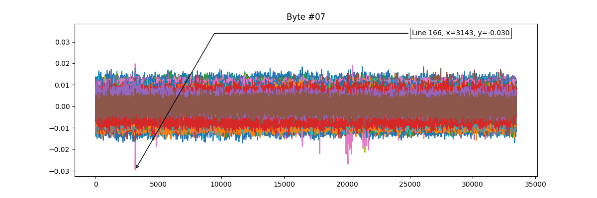

# Attacks output viewer

Project for the Embedded Systems course at Politecnico di Milano, A.Y. 2021/2022.


## General information

This is a data visualization tool for visualizing the output of a CPA/Template attack, mainly based on
[PyQt5](https://pypi.org/project/PyQt5), [PyQtGraph](https://www.pyqtgraph.org), and [NumPy](https://numpy.org).

Further information about this project can be found in the [complete report](report/report.pdf).


## Run instructions

### Input data

The input data is a set of 16 `.csv` files, each one composed by 256 columns and some tens of thousand of rows.

The values contained inside those files are real numbers between -1.0 and 1.0.

### First execution

Place the `.csv` files inside the `data/input/csv/` directory.

As a preprocessing step, only if it is the first execution, you must run the two initial scripts
as specified right below (respect the execution order).

1. Go into the `src/utils/` directory:
   ```commandline
   cd src/utils/
   ```

2. Convert the `.csv` files into `.npy` files:
    ```commandline
    python csv_to_npy_conversion.py
    ```
   If the script has been successfully executed, then you should find all your new `.npy` files inside
   the `data/output/npy/` directory.

3. Detect the peak of each file, store the result, and generate some images of those bytes:
    ```commandline
    python peaks_detection.py
    ```
   If the script has been successfully executed, then you should find the `peaks.csv` file inside the
   `data/output/csv/` directory.

At this point you are ready to run the tool:
```commandline
cd ..
python main.py
```

### Later executions

If you have already run the program at least once, then there is no need to perform the preprocessing step
anymore (unless you want to [use a new set of data](#how-to-use-a-new-set-of-data)).

You can directly execute the program:
```commandline
python main.py
```

### How to save images of the plots

If you want to save the plots of every the bytes with all the lines, all at once, then you can execute
the peak detection script with an additional argument:
```commandline
python peaks_detection.py --save-png
```

If the script has been successfully executed, then you should find both the `peaks.csv` file inside the
`data/output/csv/` directory, and all the `.png` files inside the `data/output/png/` directory.


### How to use a new set of data

If you need to change the CSV files you want to visualize, you must delete all the `.csv` files under
`data/input/csv/`, add there the new set of `.csv` files, and then re-run the two initial scripts that
will overwrite the content under `data/output/`.


## Codebase structure

After running the two initial scripts, the structure of the codebase will be the following:
```txt
|-- attacks_output_viewer
    |-- data
    |   |-- input
    |   |   `-- csv
    |   |       |-- 0.csv
    |   |       |-- 1.csv
    |   |       |-- ...
    |   |       |-- 15.csv
    |   |       `-- README.md
    |   `-- output
    |       |-- csv
    |       |   `-- peaks.csv
    |       |-- npy
    |       |   |-- 00.npy
    |       |   |-- 01.npy
    |       |   |-- ...
    |       |   `-- 15.npy
    |       |-- png
    |       |   |-- 00_peak.png
    |       |   |-- 01_peak.png
    |       |   |-- ...
    |       |   `-- 15_peak.png
    |       `-- README.md
    |-- README.md
    |-- report
    |   |-- config_files
    |   |   |-- config.tex
    |   |   `-- title_page.tex
    |   |-- img
    |   |   |-- logo_polimi_ing_indinf.eps
    |   |   |-- main_window.png
    |   |   |-- multiple_curves.png
    |   |   |-- raggiera_polimi.eps
    |   |   |-- single_curve.png
    |   |   `-- static_plot.png
    |   |-- report.pdf
    |   `-- report.tex
    |-- src
        |-- graph_window.py
        |-- main.py
        |-- main_window.py
        |-- ui
        |   |-- graph_window.ui
        |   `-- main_window.ui
        `-- utils
            |-- csv_to_npy_conversion.py
            `-- peaks_detection.py
```


## Gallery

Here are three pictures of the program at runtime, and an example of an image generated by `peak_detection.py`.

<figure style="text-align:center">
   
   
   
   
</figure>


## Authors

- Leonardo Gargani
- Olivier Wartique
